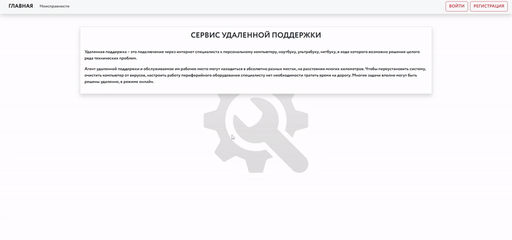

# Удалённая поддержка — Backend




[Frontend сервиса](https://github.com/besttwinkever/Web_Frontend)

Учебный проект по курсу «Разработка интернет-приложений» (МГТУ им. Н.Э. Баумана). REST API на Django REST Framework для сервиса оформления заявок на удалённую техническую помощь: каталог типовых проблем, заявки со статусами и позициями, хранение изображений в MinIO.

## Возможности

- **Issues** — каталог услуг поддержки с поиском по названию, карточка, загрузка/удаление изображения
- **Appeals** — заявки клиента: создание, просмотр, подтверждение, закрытие, фильтрация по статусу и периоду
- **Appeal issues** — состав заявки: добавление, изменение количества, удаление позиций
- **User** — регистрация и вход

## Стек

- Python, Django 5.2, Django REST Framework
- PostgreSQL + миграции
- MinIO (S3) — хранение изображений
- django-cors-headers
- Docker / docker-compose — Postgres + MinIO + сам сервис одной командой

## Структура

```
drf/                   # настройки Django-проекта
remote_support/
  models.py            # Issue, Appeal, AppealIssues
  serializers.py
  views.py             # DRF APIView-контроллеры
  minio.py             # загрузка/удаление картинок в MinIO
  migrations/
seed/
  default.jpg          # заглушка для issue без картинки
  issues/              # картинки для каждой позиции каталога
Dockerfile
docker-compose.yml
```

## Запуск

```bash
cp .env.sample .env
make up    # docker-compose up --build: Postgres + MinIO + backend + migrations
make down  # остановить и удалить volume с данными
```

API — `http://localhost:8000/`, MinIO-консоль — `http://localhost:9001/` (логин/пароль — `MINIO_ACCESS_KEY`/`MINIO_SECRET_KEY` из `.env`).
